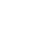

Credits
=======

Images
------
-  — [Ionicons](https://ionicons.com)
-  — [Freepic](https://www.freepik.com)
-  — [Estonian coat of arms](https://en.wikipedia.org/wiki/Coat_of_arms_of_Estonia)
-  — [Zlatko Najdenovski](http://www.pixelinspired.com)
-  — [Eleonor Wang](https://twitter.com/eleonor_wang)
-  — [Freepic](https://www.freepik.com)

- <i class="ra-icon-pdf"></i> — [Google](https://google.com).
- <i class="ra-icon-ppt"></i> — [Icon54](https://icon54.com).
- <i class="ra-icon-doc"></i> — [Icon54](https://icon54.com).
- <i class="ra-icon-ddoc"></i> — [RIA & Tank OÜ](https://www.ria.ee/et/riigi-infosusteem/elektrooniline-identiteet-eid/sumboolika.html).
- <i class="ra-icon-html"></i> — [Freepik](https://www.freepik.com).
